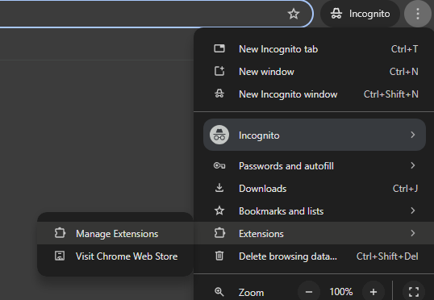
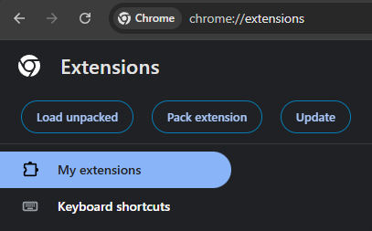

# Redact Demon
[](#)[](#)[](#)[](#)
<!-- TABLE OF CONTENTS -->
<details>
  <summary>Table of Contents</summary>
  <ol>
    <li>
      <a href="#about-the-project">About The Project</a>
    </li>
    <li>
      <a href="#getting-started">Getting Started</a>
      <ul>
        <li><a href="#prerequisites">Prerequisites</a></li>
        <li><a href="#installation">Installation</a></li>
      </ul>
    </li>
    <li><a href="#features">Features</a></li>
    <li><a href="#usage">Usage</a></li>
    <li><a href="#contributing">Contributing</a></li>
    <li><a href="#license">License</a></li>
    <li><a href="#acknowledgments">Acknowledgments</a></li>
  </ol>
</details>


<!-- ABOUT THE PROJECT -->
## About The Project

With LLM tools like ChatGPT, Gemini, and Claude becoming mainstream in workplaces, professionals often risk exposing sensitive or personal data without realizing it. Our project is a Chrome extension that provides real-time Personal Identifiable Information (PII) detection and redaction before anything is sent to an AI service. This ensures users—especially in sensitive fields like healthcare and law—can leverage AI safely without compromising confidentiality.

<p align="right">(<a href="#readme-top">back to top</a>)</p>

## Getting Started

### Prerequisites

* npm
  ```sh
  npm install npm@latest -g
  ```
* Google Chrome

### Installation
**Important: If you follow the optional steps (needs ~4GB of space), the extension will start up faster since it won’t have to re-download the NER model.**


1. Clone the repo
   ```sh
   git clone https://github.com/ppv-1/redact-demon.git
   ```
3. Set directory 
    ```sh
   cd redact-demon
   ```
   ```bash
    redact-demon/
    ├── public/
    ├── redact-demon/ <--- **here**
    ├── training/
    ├── .gitignore
    ├── LICENSE
    └── README.md
3. (Optional) Download NER model from Google Drive [here](https://drive.google.com/uc?export=download&id=1_vWTB0wwjrmJEly-D4VuD3GVfCvx3-3t)
3. (Optional) Extract zip file
3. (Optional) Place its contents in this folder
    ```bash
        redact-demon/
        ├── public/
        ├── redact-demon/
        │   └── public/ 
        │      └── assets/ <--- **here**
        ├── training/
        ├── .gitignore
        ├── LICENSE
        └── README.md
4. Install NPM packages
   ```sh
   npm install
   ```
5. Run the project
   ```js
   npm run dev
   ```
6. Open your Chrome Browser
6. Go to Manage Extensions


7. Go to Load unpacked

8. Load the dist folder 
    ```bash
    redact-demon/
    ├── public/
    ├── redact-demon/ 
    │   └── dist/ <--- **here**
    ├── training/
    ├── .gitignore
    ├── LICENSE
    └── README.md

<p align="right">(<a href="#readme-top">back to top</a>)</p>


## Features
1. One step redaction for all PII
2. Double layer of detection through Regex and the NER model
3. Simple alert system for PII entities detected
4. Local model to prevent any data from leaving your browser
5. Customise which patterns you want to redact (E.g Don't redact emails, redact URLs)


<p align="right">(<a href="#readme-top">back to top</a>)</p>


## Usage
- [Youtube Demo](https://youtu.be/GcwakjGYTpE)

<p align="right">(<a href="#readme-top">back to top</a>)</p>


<!-- CONTRIBUTING -->
## Contributing
If you have a suggestion that would make this better, please fork the repo and create a pull request. You can also simply open an issue with the tag "enhancement".
Don't forget to give the project a star! Thanks again!

1. Fork the Project
2. Create your Feature Branch (`git checkout -b feature/AmazingFeature`)
3. Commit your Changes (`git commit -m 'Add some AmazingFeature'`)
4. Push to the Branch (`git push origin feature/AmazingFeature`)
5. Open a Pull Request


<!-- LICENSE -->
## License

Distributed under the GNU GENERAL PUBLIC LICENSE Version 3. See `LICENSE.txt` for more information.

<p align="right">(<a href="#readme-top">back to top</a>)</p>

## Acknowledgments
Referenced regular expressions from [here](https://github.com/dneverson/PII_Sanitizer_Extension)<br>Hugging Face NER model can be found [here](https://huggingface.co/Xenova/distilbert-base-multilingual-cased-ner-hrl)

<p align="right">(<a href="#readme-top">back to top</a>)</p>


